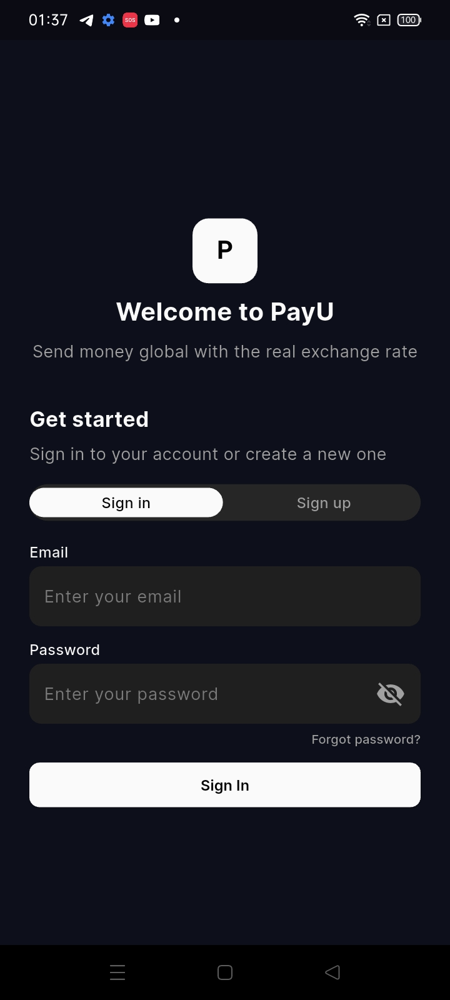
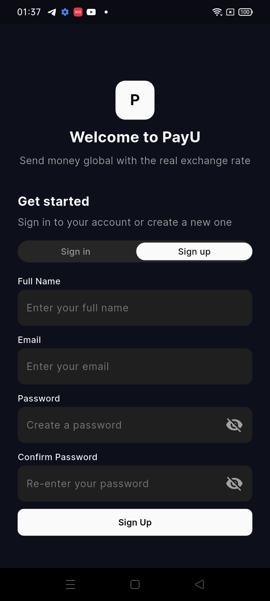
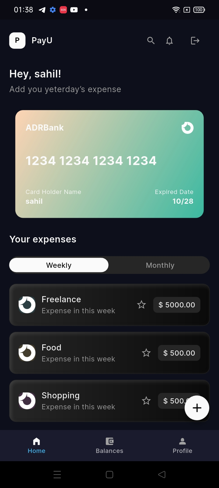
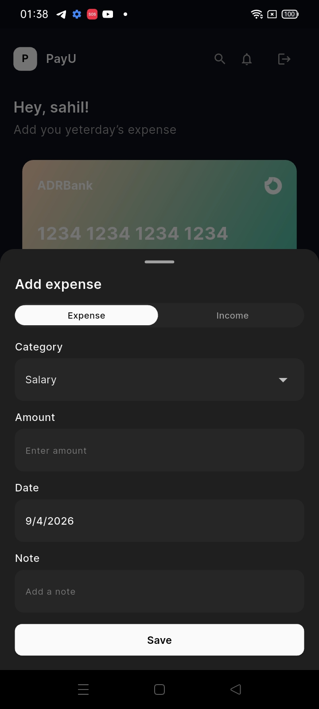
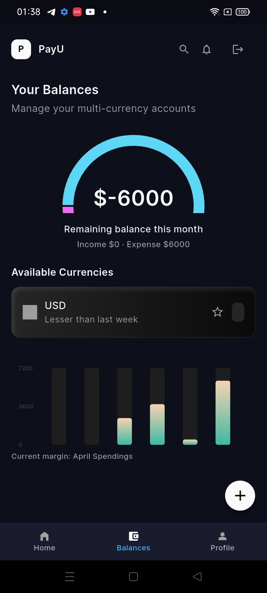
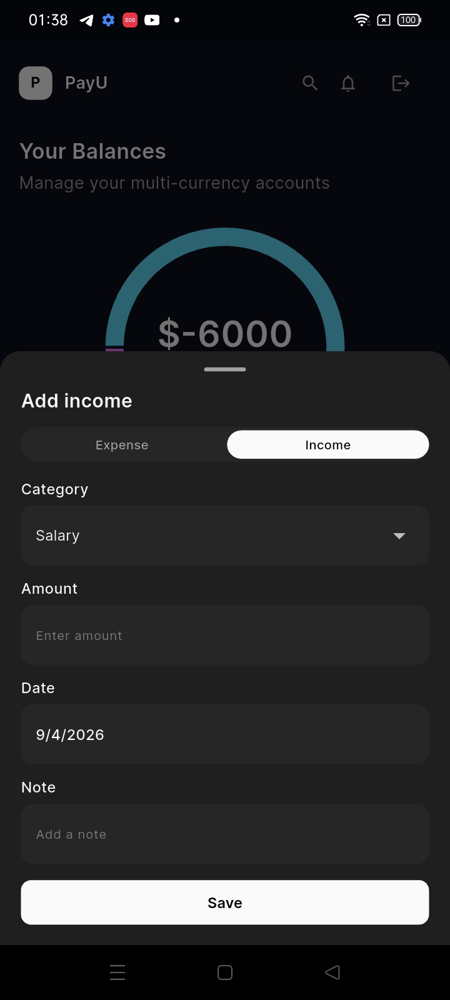
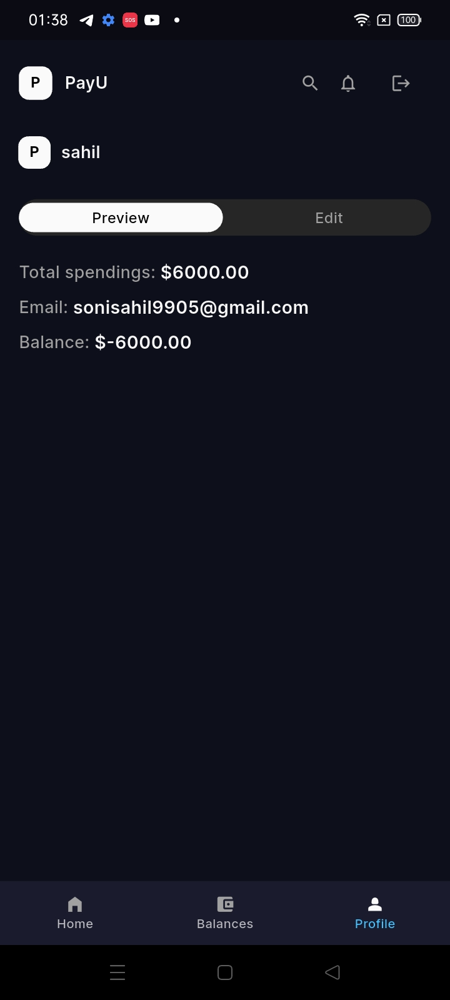
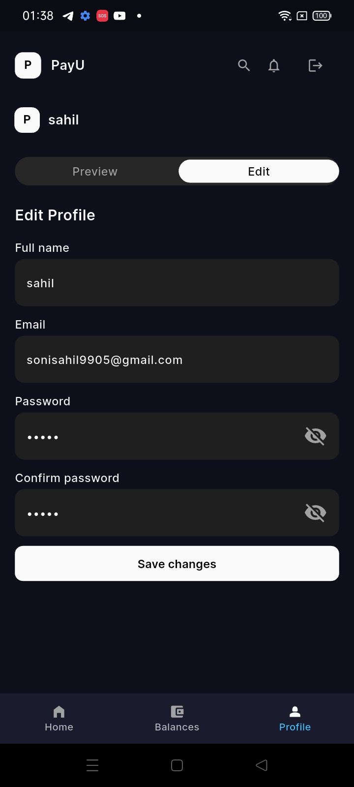

# Tuff Project

A clean, mobile-first Flutter app that focuses on everyday money routines:
fast onboarding, a quick home snapshot, balances at a glance, and a simple
profile hub.

## About the App

Tuff Project is split into four core modules. Each one is designed to be
straightforward and fast to use, so the flow feels natural instead of heavy.

### 1) Auth

Purpose: Onboard users quickly and let them get into the app with minimal
friction.

What it does:

- Entry point for sign-in and sign-up
- Clean form layout with primary action buttons
- Clear spacing and typography for fast scanning

How it works:

- The module presents the user with the main auth screen first
- CTA buttons route to the relevant auth flow
- Input fields are focused on speed and clarity, not heavy steps

Screenshots:

### 2) Home

Purpose: Give a quick snapshot of important info right after login.

What it does:

- Overview cards and highlights
- Quick entry points to core actions
- A compact layout that fits small screens well

How it works:

- The home screen loads the primary overview widgets first
- Cards are arranged to keep the top of the page most informative
- Navigation is kept within thumb reach using the bottom bar

Screenshots:

### 3) Balances

Purpose: Show wallet and account balance information clearly and quickly.

What it does:

- Balance cards and summarized totals
- Minimal visual noise to keep numbers readable
- Consistent spacing for fast scanning

How it works:

- The top section highlights the primary balance
- Secondary balances are grouped in a clean list
- The layout stays stable while switching tabs

Screenshots:

### 4) Profile

Purpose: A compact space for user info and app-related settings.

What it does:

- Personal information and preferences
- Account actions grouped in one place
- Simple, human-friendly layout

How it works:

- Profile details are shown at the top for quick context
- Actions are grouped below for easy access
- The overall structure keeps the page light and readable

Screenshots:

## Setup (Windows)

### Prerequisites

- Flutter SDK (stable)
- Android Studio (SDK Manager + emulator)
- Git (recommended)
- A physical Android device or an emulator

### 1) Install Flutter

1. Download Flutter (stable) from https://docs.flutter.dev/get-started/install/windows
2. Extract to a short path, for example `C:\src\flutter`
3. Add Flutter to PATH:
   - Open Environment Variables
   - Add `C:\src\flutter\bin` to PATH
4. Verify:
   - Run `flutter --version`

### 2) Install Android Studio + SDK

1. Install Android Studio
2. Open Android Studio > SDK Manager
3. Install:
   - Android SDK Platform (latest stable)
   - Android SDK Build-Tools
   - Android SDK Command-line Tools (latest)
4. Open SDK Manager > SDK Tools and check the items above if needed

### 3) Accept Android licenses

1. Run `flutter doctor --android-licenses`
2. Accept all licenses

### 4) Create an emulator (optional)

1. Open Android Studio > Device Manager
2. Create a new virtual device (Pixel recommended)
3. Download a system image if prompted
4. Start the emulator

### 5) Verify setup

1. Run `flutter doctor`
2. Resolve anything marked with a red X

### 6) Install dependencies

1. Open this project folder
2. Run `flutter pub get`

## Run the App

### Android (emulator or device)

1. Start an emulator or connect a device with USB debugging enabled
2. Run `flutter devices` to confirm detection
3. Run `flutter run`

### iOS (macOS only)

1. Set up Xcode and signing
2. Run `flutter run`

### Web (optional)

1. Run `flutter run -d chrome`

## Tech Stack

- Flutter
- GetX (state management and routing)
- Google Fonts
- ScreenUtil

## Notes

- If a build fails after pulling changes, run `flutter clean` and then
  `flutter pub get` again.
- If Android builds fail, re-run `flutter doctor` and verify the SDK paths
  inside Android Studio settings.
